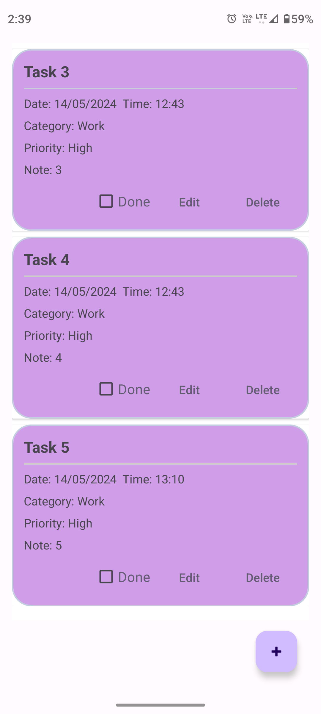
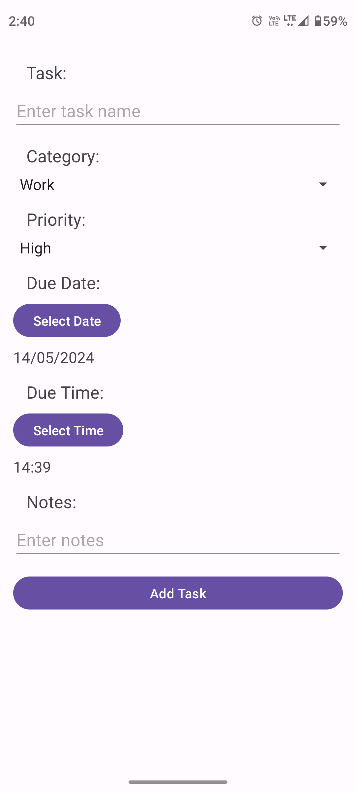
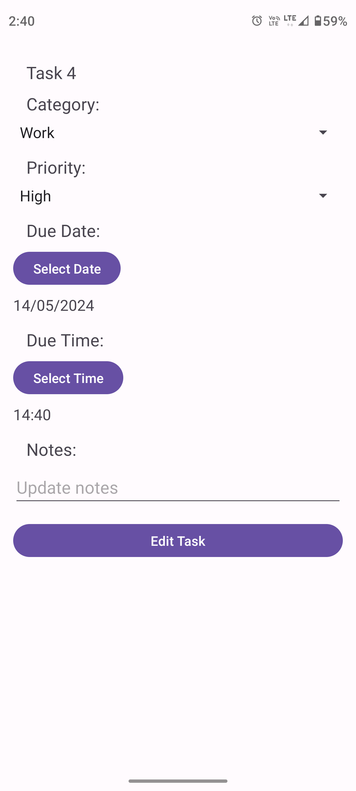

# ToDoList App - Android

This is a simple To-Do List application developed for Android using Java and SQLite. The app allows users to create tasks, mark them as done, edit existing tasks, and delete tasks. It provides features like setting priority, adding notes, and categorizing tasks for better organization. With a user-friendly interface, it helps users manage their daily tasks efficiently.

## Features
- **Create Tasks**: Easily add new tasks with a name, date, time, category, priority, and optional notes.
- **Edit Tasks**: Modify existing tasks to update details such as name, date, time, category, priority, or notes.
- **Delete Tasks**: Remove unwanted tasks with a simple delete button.
- **Mark Tasks as Done**: Keep track of completed tasks by checking the done checkbox.
- **Set Priority and Category**: Categorize tasks by assigning them a priority level and category.
- **Add Notes**: Include additional details for tasks by adding notes.

## Technologies Used
- **Java**: Primary programming language used for Android app development.
- **Android Studio**: Integrated Development Environment (IDE) used for Android app development.
- **SQLite**: Lightweight relational database management system used for local data storage.

## How to Use
1. Clone the repository to your local machine.
2. Open the project in Android Studio.
3. Build and run the project on an Android emulator or physical device.
4. Start managing your tasks efficiently!

## Screenshots

## Contact Information

- **Developer**: Shiv Prakash Verma
- **Email**: shivprakashlps@gmail.com
- **College**: IIT Ropar
## Contributing
Contributions are welcome! If you find any bugs or have suggestions for improvements, please open an issue or create a pull request.

## License
This project is licensed under the [MIT License](LICENSE).
